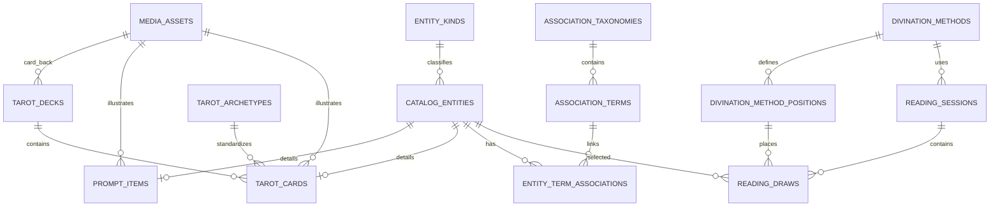

# Cyber Tarot 数据库

这是项目的第一版数据层，目标是把提示物、塔罗牌和可扩展的语义关联分开建模。

## 核心设计



- `catalog_entities` 是统一内容入口。提示物和塔罗牌都先有一个实体，因此关联表不需要为每种内容各建一份。
- `prompt_items` 保存提示物文本、标签和主图引用。
- `tarot_archetypes` 固定定义 RWS 78 张标准原型；`tarot_decks` / `tarot_cards` 保存各套牌的具体实现。
- `tarot_cards` 通过稳定牌码引用原型，允许同一原型在不同套牌中有不同图像和解释。
- 每个 `tarot_decks` 通过 `back_image_asset_id` 绑定独立卡背，并记录卡背旋转后是否对称。
- `media_assets` 只接收 PNG，保存相对存储键、尺寸、字节数和 SHA-256。图片本体不塞进数据库。
- `association_taxonomies` / `association_terms` 定义关联体系及其选项；初始种子包含 12 星座和 16 种 MBTI。
- `entity_term_associations` 将任意内容实体关联到分类项，并支持关系类型、权重、注释和扩展元数据。
- `divination_methods` / `divination_method_positions` 定义可版本化的占卜方法与位置规则。
- `reading_sessions` / `reading_draws` 保存每次实际占卜及抽到的提示物或塔罗牌。

所有扩展字段使用 `jsonb`，但高频查询字段仍保持结构化。以后增加“元素”“行星”等关联，只需插入新的 taxonomy 和 terms，不需要修改表结构。

塔罗牌数据、牌码和图片规范参见 [`docs/tarot-card-format.md`](docs/tarot-card-format.md)，机器校验规则位于 [`schemas/tarot-card.schema.json`](schemas/tarot-card.schema.json)。初始占卜方法参见 [`docs/divination-methods.md`](docs/divination-methods.md)。

## 图片目录

开发环境建议按以下路径存放：

```text
storage/
├── prompts/   # 提示物 PNG
└── tarot/     # 塔罗牌 PNG
```

`media_assets.storage_key` 保存相对于 `storage/` 的路径，例如：

```text
prompts/moonlit-door.png
tarot/rider-waite/major-00.png
tarot/rider-waite/card-back.png
```

运行时图片默认不提交 Git；生产环境可以把相同的 `storage_key` 映射到 S3、R2 或其他对象存储。

## 本地启动

1. 复制 `.env.example` 为 `.env`，修改开发密码。
2. 启动 PostgreSQL：

   ```powershell
   docker compose up -d
   ```

3. 查看健康状态：

   ```powershell
   docker compose ps
   ```

首次创建数据卷时，Docker 会依次执行：

- `db/migrations/001_initial_schema.sql`
- `db/migrations/002_standardize_tarot_cards.sql`
- `db/migrations/003_add_tarot_deck_backs.sql`
- `db/migrations/004_switch_media_to_png.sql`
- `db/migrations/005_add_divination_methods.sql`
- `db/seeds/001_association_terms.sql`
- `db/seeds/002_rws_archetypes.sql`
- `db/seeds/003_divination_methods.sql`

若数据库卷已经存在，入口脚本不会再次自动执行。开发阶段需要完全重建时，可明确运行 `docker compose down -v` 后再启动；该命令会删除本项目的本地数据库卷。

## 验证

数据库启动后运行事务型冒烟测试（测试数据最终会回滚）：

```powershell
Get-Content -Raw db/tests/schema_smoke_test.sql |
  docker compose exec -T database psql -U cyber_tarot -d cyber_tarot
```

## 新增关联体系示例

```sql
SET search_path TO tarot, public;

INSERT INTO association_taxonomies (code, name)
VALUES ('element', '元素');

INSERT INTO association_terms (taxonomy_id, code, label, sort_order)
SELECT id, 'fire', '火', 1
FROM association_taxonomies
WHERE code = 'element';
```
